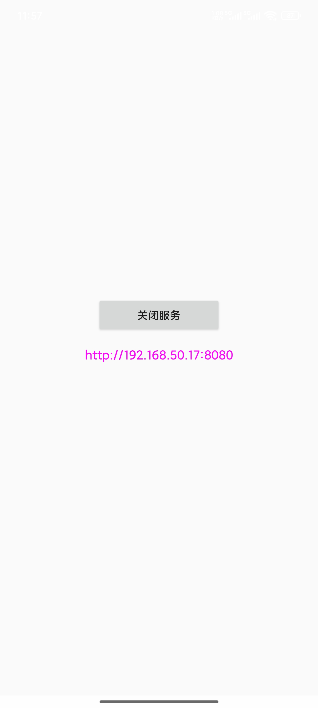
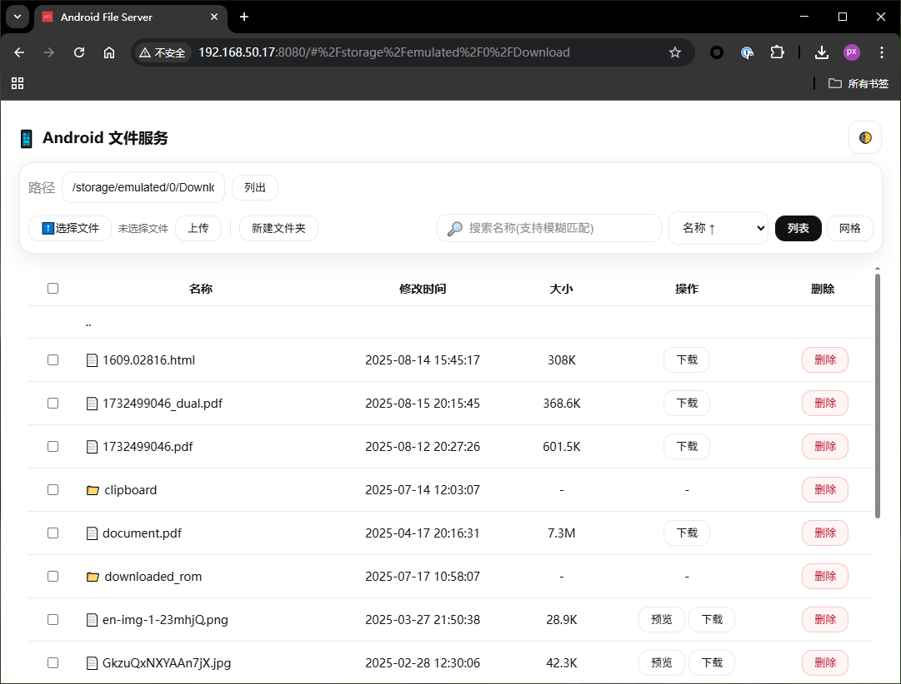

# 📂 AndFileServer (Android)

[中文说明](README.md)

## 🚀 Overview
AndFileServer is a lightweight **remote file manager** designed for Android devices. Once the service is running on your phone, you can manage storage from any browser on the same network—browse folders, upload, download, preview, rename, delete, or zip files without installing extra clients.

## ✨ Highlights

- **Rich browsing modes** – switch between list and thumbnail grid views; search and sort results instantly.
- **Fast uploads** – drag & drop or multi-select files with real-time percent progress indicators.
- **Smart downloads** – one-click single downloads with toast feedback; batch queue with floating progress panel, size estimation, and cancel button.
- **Powerful preview** – inline photo/video player with previous/next navigation; images support mouse-wheel zoom plus drag-to-pan.
- **File operations** – create folders, rename files/directories, delete items, or zip selections for convenient download.
- **Access control** – optional auth token (configure in app) keeps the service private.

## 📲 Quick Start

1. Launch the AndFileServer service on your Android device.
2. Ensure your phone and computer share the same LAN, then open:
   ```
   http://<DEVICE_IP>:8080
   ```
3. Manage files directly from the web UI.

> 📌 Tip: Enable the auth token in configuration for additional security before exposing the service.

## 🖥️ Browser Walkthrough

- **Path bar** – edit the path manually or click folders in list/grid view to navigate.
- **Selection & bulk actions** – multi-select or select all; the bulk bar shows counts and exposes batch download/delete/zip.
- **Drag-and-drop uploads** – dropping files anywhere on the page triggers the upload overlay automatically.
- **Preview controls** – image/video viewer supports keyboard arrows and ESC to close; zoomed images pan with click-drag.

## 🔐 Security & Deployment Notes

- The default port is 8080; restrict access via router/firewall rules if exposing externally.
- When auth token is enabled, requests must include `X-Token` in headers to reach APIs.
- Prefer LAN usage; if you need remote/public access, combine the service with authentication and HTTPS reverse proxying.

## 🛠️ Development

- Standard Android Studio/Gradle project – clone and run directly inside Android Studio.
- Web assets live in `app/src/main/assets/website/`; tweak HTML/CSS/JS and refresh to see changes.

## 📸 Screenshots

**Android UI**



**Desktop Web UI**



---

Switch back to the Chinese documentation via [README.md](README.md).

