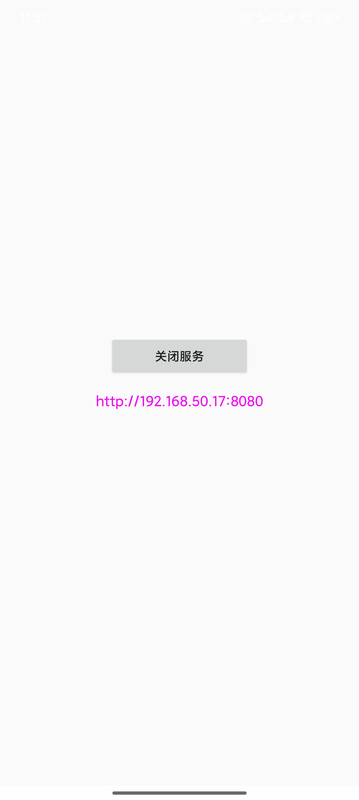

# 📂 AndFileServer (Android)

[English README](README.en.md)

## 🚀 项目简介
AndFileServer 是一个运行在 **Android** 设备上的轻量级 **远程文件管理器**。通过同一局域网内的浏览器即可访问并管理手机存储，支持浏览、上传、下载、预览、重命名、删除、压缩等常见操作，适合临时在电脑上处理手机文件或做简单的家庭 NAS。

## ✨ 核心特性

- **多视图浏览**：提供列表视图与缩略图网格视图，快速切换并支持搜索、排序。
- **极速上传**：拖拽或多选文件批量上传，实时显示百分比进度与状态提示。
- **智能下载**：单文件下载支持 toast 提示，批量下载提供悬浮进度面板、累计大小统计与取消按钮。
- **强大预览**：图片/视频可在网页内直接预览，支持上一张/下一张切换；图片支持鼠标滚轮缩放与拖拽平移。
- **文件操作**：可新建文件夹、重命名文件/目录、批量删除或打包 ZIP 后下载。
- **权限控制**：可选鉴权 Token（在配置中开启）以限制访问。

## 📲 快速开始

1. 在手机上启动 AndFileServer 服务。
2. 确保手机与电脑在同一局域网，使用电脑浏览器访问：
   ```
   http://<手机 IP>:8080
   ```
3. 在网页端完成文件管理操作。

> 📌 提示：首次访问时可在设置或代码中配置 Token，增强安全性。

## 🖥️ 浏览器操作说明

- **路径栏**：直接编辑路径或点击网格/列表中的文件夹进入下一级。
- **选择 & 批量**：支持多选、全选，面板实时显示选中数量，可执行批量下载/删除/打包。
- **拖拽上传**：在页面任意位置拖入文件，自动出现上传提示层。
- **预览控件**：图片/视频预览支持键盘方向键、ESC 关闭等快捷操作。

## 🔐 安全 & 部署建议

- 默认监听 8080 端口，如需对外使用请结合路由器或系统防火墙控制访问。
- 启用 Token 后，浏览器需要在请求头中携带 `X-Token` 才能访问 API。
- 建议仅在可信局域网内使用；如需公网访问，务必配置认证与 HTTPS 反向代理。

## 🛠️ 开发构建

- Android Studio/Gradle 项目，拉取后即可在 Android Studio 中运行。
- 前端资源位于 `app/src/main/assets/website/`，可直接修改 HTML/CSS/JS 后热重载。

## 📸 截图

**Android 端界面**



**PC 端网页**


---

如需英文说明，请查看 [README.en.md](README.en.md)。
