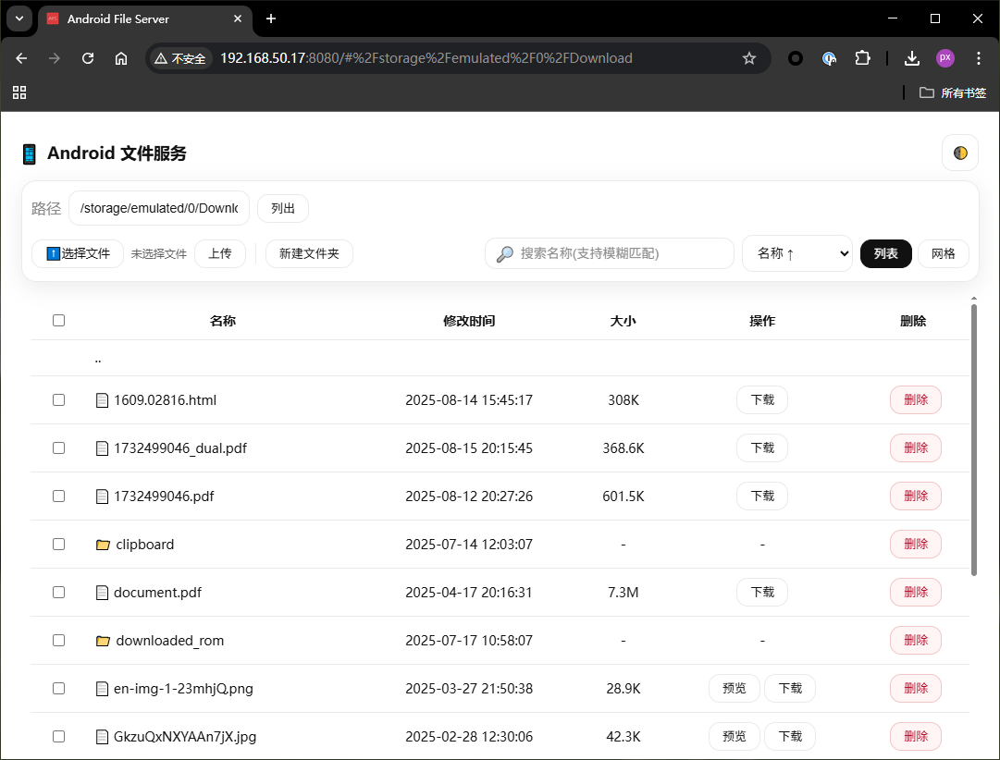

# 📂 AndFileServer (Android)

## 🚀 简介
这是一个运行在 **Android** 设备上的轻量级 **远程文件管理工具**。  
通过电脑浏览器即可直接访问和管理手机里的文件，支持目录文件浏览、上传、下载、预览和删除操作。  
无需额外安装客户端，手机开服务 → 浏览器访问 → 立即使用。

---

## ✨ 功能特性

### 🔍 文件浏览
- 列表视图：适合查看详细信息（大小、修改时间）。
- 网格视图：带缩略图，直观浏览图片/视频。
- 支持进入子文件夹、返回上级目录。

### 📤 上传
- 拖拽文件到网页即可上传。
- 也可手动选择多个文件批量上传。
- 上传进度实时显示（百分比 + 状态提示）。

### 📥 下载
- **单文件下载**
    - 点击“下载”按钮即可保存到电脑。
    - 支持 toast 提示，避免误操作。
- **批量下载**
    - 选中多个文件后点击“批量下载”。
    - 文件逐个下载，避免浏览器拦截。
    - 右下角显示进度面板：
        - 当前下载的文件名
        - 已完成/总文件数
        - 已下载大小与总大小
        - 进度条实时更新
    - 支持「取消」按钮，随时终止任务。

### 🖼️ 预览
- **图片**：点击“预览”即可在浏览器中查看原图。
- **视频**：点击“播放”可直接在网页播放器中播放。

### 🗑️ 删除
- 支持删除文件和文件夹。
- 操作前有确认提示，避免误删。

---

## 📲 使用方式
1. 在手机上启动服务。
2. 在同一局域网的浏览器中访问：
   ```
   http://<手机IP>:8080
   ```
3. 即可在电脑网页上使用上述所有功能。

---

## 📌 注意事项
- 批量下载时的进度条是基于文件大小估算的。
- 建议在 **局域网环境** 下使用。
- 大文件夹可考虑打包后再下载，更高效。

## 📸 截图

Android端界面：


  
PC端页面：




